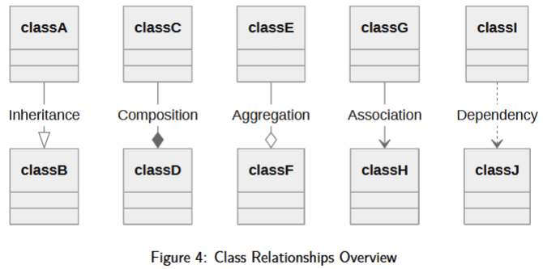
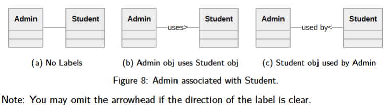
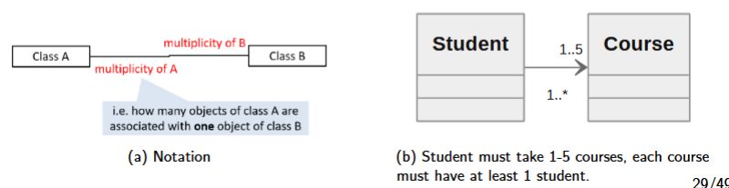
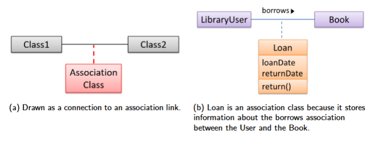

# Course Outcomes
**Aims & Objectives**

**Syllabus**
Basics of application development and software engineering (technologies, approaches, principles and issues in designing IT applications systems)  
Major topics:
- rapid web frameworks
- scripting languages
- web and mobile interfaces
- designing and deploying web and mobile services
- operational considerations
- technical tradeoffs
Tools and techniques for app dev: 
- object-oriented system modelling
- testing methodologies
- security techniques

**Learning Outcomes**
1. Develop an appreciation for the technologies available, and develop expertise in the current technologies, as they are used in application systems development.
2. Develop the technical and conceptual capabilities to design and deploy applications within and across Internet, web, and mobile platforms.
3. Understand state-of-the-art application development techniques, such as object-oriented system modelling and design.
4. Be aware of common security risks when developing applications and ways to prevent them.

## Table of contents  

0. [Setup](#l01-setup)
1. [Project Management](#l02-project-management)
3. [Requirements](#l03-requirements)
4. [Object-Oriented Design](#l04-object-oriented-design)
5. [Backend - FastAPI](#l05-backend---fastapi)
7. [Deployment](#l07-deployment)
8. [Frontend - Javascript](#l08-frontend---javascript)
9. [Integration](#l09-integration)
10. [Frontend - HTML + CSS](#l10-frontend---html--css)
11. [Frontend - React Native](#l11-frontend---react-native)
12. [Security](#l12-security)
13. [Summary](#l13-summary)

# L01: Setup
## 1.1 *nix Command Line Interface (CLI)
### Command prompts
|  | Terminal (emulated)/Console (physical) | Shell | Linux Command Prompt |
|---|---|---|---|
| What it is | keyboard inputs -> prints text output to user | interacts w OS to execute commands (from terminal or scripts) | user ($, %) or root (#) types a command for shell to execute task |
| Examples | WIN Terminal, Linux Terminal, mac xterm/Console/konsole | WIN powershell MS-DOS, Linux Bourne Shell, Bourne Again Shell, Mac Z shell | [user_1@personalcomputer:-]$ |

### Control Sequences (Shortcuts/Hotkeys)  
- `Ctrl` + `d` : Exit/end of input to a program
- `Ctrl` + `c` : Terminate current program
- `Ctrl` + `z` : Suspend current program
    - `fg` suspended program brought to foreground
    - `bg` suspended program brought to background
> [!IMPORTANT]
> Do not use Suspend `Ctrl` + `z`  to Terminate `Ctrl` + `c` !

### Command Documentation
- `man` MANual : interactive manual for `ls`. ( quit using `q` )
- `info` INFOrmation : alternative to `man` but not widely used
- `help` or `-h` or `--help` Help command : find help about commands

## 1.2 Linux Navigation
**Windows vs *nix system**
|  | Windows | *nix |
|---|---|---|
| Organization | Usually C:\ | Single 'root' / |
| Case | insensitive | sensitive |
| Path separator | \ | / |
| Forbidden char | `<>:"/\|?*` | `/` |
| File system | NTFS, exFAT | UFS(Unix), Ext4(Linux), APFS(MacOS) |
| Hidden files | File Property | Names starting with `.` |

***nix Pathing**
`~` home directory  
`.` current working directory (cwd)  
`..` parent directory (prev dir)  
`pwd` prints working directory  
`ls` LiSts contents of a directory  
`mkdir` MaKe a subDIRectory  

## 1.3 Linux File Management
`cd` Change Directory  
`rmdir` ReMove a subDIRectory  
`cp` CoPy subdirectory/file  
`mv` MoVe subdirectory/file  
`rm` ReMove subdirectory/file  
`cat` CATenate file to screen  

> [!NOTE]
> `ls` and `cat` are different!

## 1.4 Connect to Remote Server
**SSH (Secure Shell Protocol)**  
`ssh <username>@<hostname>`
- <username> is remote username
- <hostname> is address or hostname of remote computer (server/host)

**Copy to/from local/remote**  
`scp <source> <destination>`
- local: <path> (same as `cp`)
- remote: <username>@<hostname>:<path>

# L02: Project Management
## 2.1 Revision Control
Revision Control Software (RCS) allows for tracking, collaboration, recovery and parallel work.  
### Git
Fun fact: Git was created by creator of Linux!  
**Git Hosting Platforms**
- GitHub
- GitLab
- Bitbucket
- Azure Repos
- SourceForge

Typical Git Workflow:  
- Initialize: Config -> Create -> Clone -> Fork
- Saving History: Stage -> Comment -> Push -> Merge
- Using History: Tag -> Diff -> Checkout -> Pull

### Setting up & CLI git commands
**Config**  
> `git config --global user.name "Your Name"`
> `git config --global user.email "email@email.com"`
- `global` sets these values for ALL repo on local machine

**Create**  
> `git init`
- creates new empty repo (.git folder) in cwd

**Clone**  
> `git clone <repo-url>`
- Cloning also downloads entire revision history

**Fork**  
> `gh repo fork <repo-url>`
- Creates a remote copy of a remote repo (`upstream`)
- Allows experimentation of repo you don't control
- Propose changes back via a pull request (mechanism for contributing code to remote repo)

**Stage**  
> `git add <file>`
- Mark changes in working directory to include next commit

**Commit**  
> `git commit -m "message"`
- Save staged changes as a new revision in the history

**Push**  
> `git push`
- Copy your latest commits from your local repository to a remote repository.
> [!IMPORTANT]
> Pushing is only possible if both repos share common history

**Merge**  
> `git merge <branch>`
- Combine changes from diff branches/sources into current branch
- Resolve conflicts, complete merge with `git add <file>`

**Pull**
> `git pull`
- Fetch & integrate changes from remote repo to current branch
- Combines fetch (download changes) and merge (integrate changes)

**Diff**
> `git diff <branch1> <branch2>`
- Shows difference between files/commits/branches OR unstaged changes in working directory (if used without branches)

**Checkout**
> `git checkout <branch>`
- Switches to specific branch
- Restore file to previous state: `git checkout <commit> -- <file>`

**Tag**
> `git tag <tagnanme>` (or `git tag` to list all tags)
- Mark specific points in history as important (e.g. releases)
- Annotated tag (with optional message): git tag -a <tagname> -m "message"

## 2.2 Project Planning
### Team Structures
- Egoless
    - All members share equal responsibility & make decisions by consensus
- Chief programmer
    - Single chief programmer takes lead and makes key decisions
- Strict hierarchy
    - Clear chain of command w/ each member reporting to a superior

### Work Breakdown Structure
| Task ID | High Level Task | Estimated Effort | Pre-req Task |
|---|---|---|---|
| A | Major Task 1 | 1 man day | - |
| B | Major Task 2 | 1.5 man days | A |
| C | Major Task 3 | 2.5 man days | A |

Task Breakdown  
| Task ID | Task | Estimated Effort | Pre-req Task |
|---|---|---|---|
| C.1 | Well-defined task (when task is considered done) | 1 man day | A |

### Milestones
End of a stage indicating significant progress.
- Intermediate product release
- Should account for dependencies and priorities

Example:  
| Iteration | Description |
|---|---|
| 1 | Backend Prototype |
| 2 | Website Prototype |
| 3 | Mobile Prototype |

### Issue Trackers (bug trackers)
Check GitHub Issues tab

### Gantt Charts
Time vs Tasks (represented using horizontal bars)

### PERT Charts
Program Evaluation Review Technique (PERT) chart shows order/sequence of tasks

## 2.3 SDLC Process Models
Software Development Life Cycle (SDLC):
1. Requirement
2. Analysis
3. Design
4. Implementation
5. Testing

### Process Models
1. Sequential model (Waterfall)
    - linear process
2. Iterative model (unified process)
    - Each iteration builds on previous versions, gradual improvements
    - breadth-first: updates most components and features parallel (working product each time)
    - depth-first: develops some components in detail (may not always be working, esp at the start)
    - Unified Process: Flexible and customizable process model framework rather than a single fixed process.
        - Phases|Activities|Typical Artifacts
3. Agile model *(considered iterative)* (e.g. Scrum, Extreme Programming (XP))
    - Emphasise flexibility + collaboration + rapid delivery of small, functional increments
    - Agile manifesto
    - Scrum vs Extreme Programming

# L03: Requirements
## 3.1 Requirements
| Brownfield Projects | Greenfield Projects |
|-|-|
| Enhancing, replacing, integrating existing systems | Developing new system from scratch |

### Categories of requirements
- **Functional requirements**: Specifies what the system _should_ do
    - **Examples:** User can do this or that
- **Non-functional requirements**: Specifies _constraints_ under which system is developed and operated
    - Data requirements: size, volatility, persistency, etc.
    - Environment requirements: technical environment, compatibility
    - Other categories: Accessibility, Capacity, Compliance, Documentation, Disaster recovery, Efficiency, Extensibility, Fault tolerance, Interoperability, Maintainability, Privacy, Portability, Quality, Reliability, Response time, Robustness, Scalability, Security, Stability, Testability, and more
    - **Examples:** App should minimise battery, app must trigger alarm (not technically required for the app to work, but it's a constraint)

## 3.2 Specifying Requirements
**Formats**
- Prose: Natural language desc for context and rationale (textual description)
- Feature lists: High-level checklist of system capabilities (list of features of a product grouped according to criteria)
- User stories: Short statements from user's perspective (short, simple descriptions of a feature, _As a {user}, I can {function} so that {benefit}._ Benefits may be omitted if obvious)
- Use cases: Structured scenarios of user-system interactions
(Supplementary requirements: capture requirements that do not fit elsewhere. Typically NFR)

### Recipe for Brainstorming User Stories
0. Clear mind of preconceived product ideas
1. Define target user as a persona
2. Define problem scope
3. List scenarios to form narrative
4. List user stories to support scenarios

### Official Format
```
System: System Name 
Use Case: Identifier - Functionality [use case diagram: summarises actors and use cases in a system]
Actors: Entities that interact w system but not part of
Preconditions: _(optional)_ required system state before use case
Guarantees: _(optional)_ what the use case delivers upon completion

Main Success Scenario (MSS):
Steps for a use case, assuming everything proceeds without errors.

Extensions:
Exceptional/alternative flow of events
```
**Use cases guidelines**:
- Capture actor's goal/intention (not technical details)
- Emphasize interaction between system and external actors
- Describe externally observable behaviour (avoid internal system workings)
- Exclude implementation or UI specifics - focus on **outcome**
    - _User clears input_ vs _User right-clicks text box and chooses 'clear'_

## 3.3 Architecture
Architecture diagrams are free-form diagrams.

**Architectural Styles/Patterns**
- N-tier/Multi-layered/Layered: Higher layers makes use of services provided by lower layers
- Client-server: at least 1 component playing role of server and at least 1 client component accessing services of server
- Transaction processing: divides workload of system down to no. of transactions 
- Service-oriented (SOA): builds applications by combining functionalities packaged as programmatically accessible services
- Event-driven: controls flow of application by detecting events from event entities and communicating those events to interested event consumers

# L04: Object-Oriented Design
## 4.1 Design Fundamentals
**Two main aspects of design:**
1. Product/External design
    - Defines how product behaves to meet user needs
    - Done by product designers (e.g. UI, UX design)
2. Implementation/Internal design
    - Specifies how product is built to achieve desired behaviour
    - Done by softare architexts (software architecture)

### Abstraction
Focus on essential aspects of a system by hiding unnecessary details.
1. Data abstraction
    - abstracting away the lower level data items, focus on bigger entities (e.g. `Student` object instead of `name`, `dob`, etc)
2. Control abstraction
    - abstracting away details of actual control flow, focus on tasks at higher levels (e.g. using Python without knowing how binary codes or how the hardware works)
OOP class is an abstraction over related data and behaviours.

### Coupling
Measure degree of dependence between components, classes, methods.

|Low Coupling|High Coupling|
|-|-|
|Lesser dependencies of components| Higher dependencies of components|
|Easier to understand, reduce risk that change in 1 part will break others|Undesirable, maintenance and evolution difficult|

**Types of coupling**
|Type|Description|
|-|-|
|Content|One module relies on/modifies another's internals|
|Common/Global|Modules share global data, leading to hidden dependencies|
|Control|One module influences another's logic by passing control info|
|Data|Modules interact by passing only necessary data|
|External|Modules depend on external formats or protocols|
|Subclass|A subclass depends on its parent class|
|Temporal|Actions grouped only because they occur together in time|

## Cohesion
Measure of how strongly-related and focused various responsibilities of a component are
|Low Cohesion|High Cohesion|
|-|-|
|Component handles unrelated tasks| Component focuses on single, well-defined purpose|
|Harder to understand, maintain and reuse|Easier to understand, maintan and reuse|

**Improving Cohesion**
- Group code by:
    - Concept _(e.g. all student-related features together)_
    - Timing _(e,g, initialisation routines together)_
    - Data _(e.g. game session storage & retrieval together)_

## Models
Simplifies a complex system by highlighting only relevant aspects (abstraciton).

**Modeling a solution**
|Modeling Structures|Modeling Behaviours|
|-|-|
|Represents static aspects of a system (components, attributes, relationships)|Represents dynamic aspects of a system (component interaction and how they change over time)|
|Architecture diagrams, Class diagrams, etc|Use case diagrams, Sequence diagrams, etc|

## 4.2 Modeling Structures
### Class Diagrams
|Class name|
|-|
|Attributes _(optional)_|
|Methods/Operations _(optional)_|

#### Annotation for Class-like Entities
- Enumeration ``from enum import Enum   class Color(Enum): Red = 1 Blue = 2 Green = 3``
- Interface
- Abstract
#### Visibility
Indicates level of access allowed for each attribute/operation
- Private: only accessible _within class_
- Protected: accessible within class _& subclasses_
- Public: accessible anywhere
|Visibility|Java|Python|
|-|-|-|
|- private|`private`|2 leading underscores: `__private_class`|
|# protected|`protected`|1 leading underscore: `_protected_class`|
|+ public|`public`|Default|
|- package private|Default|N/A|
#### Class-level
Underlines denote class-level attributes and methods
```
class Student:
    _school_name = "NUS"

    def __init__(self, name):
        self.name = name
        self.__student_id = None

    @classmmethod
    def get_school_name(cls):
        return cls._school_name
```

|Student|
|-|
|+ name: str    - student_id:str    <u># school_name : str</u>|
|+ init(name:str)   <u>+ get_school_name():str</u>|
### Relationships
> [!IMPORTANT]
> Association can be shown as an attribute instead of a line

**Types of relationships**
- Inheritance
- Association
- Dependency
> [!NOTE]
> Only use dependency if dependency not already represented!!
> If Association/Inheritance present, no need for dependency arrow!



#### Inheritance (Is-a r/s)
Subclass <u>inherits</u> from superclass
- Base (super): OG class
- Derived (sub): Inherits from base (can add/override features)
```
class Person:
    pass
class Student(Person):
    pass
class Staff(Person):
    pass
```

#### Association (has-a r/s)
General connection between classes

```
class Person:
    def __init__(self, employer):
        self.employer = employer
class Company:
    pass
```
> In above example, `Person` relates to `Company` as an employer.
Role further away from class indicates the role played by _other_ class.

**Multiplicity** dictates how many objects take part in each association.
- `0..1` : Optional. can be linked to 0 or 1 objects
- `1` : Compulsory. MUST be linked to 1 object at all times
- `*` : can be linked to 0 or more objects
- `n..m` : number of linked objects MUST be within n to m (inclusive)


**Navigability**
- Unidirectional: only 1 object holds reference to other `-->`
- Bidirectional: both objects hold reference to each other (mutal access) `<-->`

**Association Class**


1. **Composition**: STRONG (part CANNOT exist without whole)
Parts are separate classes, but lifetime depends on whole
```
class Building:
    def __init__(self):
        self.room = Room()
class Room:
    pass
```
> In above example, `Room` is part of `Building`.

2. **Aggregation**: WEAK (part can exist <u>independently</u>)
Container-contained relationship
```
class Club:
    def __init__(self, persons):
        self.persons = persons

class Person:
    pass
```
> In above example, `Person` is member of `Club`.

#### Dependency (Uses r/s)
One class <u>temporarily</u> uses another
```

```

## 4.3 Modeling Behaviours

# L05: Backend - FastAPI
## 5.1 HTTP Request/Response
HyperText Transfer Protocol (HTTP):  
Client __(sends requests)__ -- Server __(processes and responds)__
<details>
<summary>Properties </summary>

- Stateless: Independent request; info from prev req not retained by server (regardless same client or not)
- Communicates using TCP: (port 80: HTTP, port 443: HTTPS)
- Abstraction: Hides lower-level complexity & focuses on essentials (State can be managed on top of HTTP using e.g. cookies)
</details>

<details>
<summary>Connection Types</summary>

(also known as `keep-alive` setting)
1. **Non-persistent HTTP**
    - indiv req/response uses *separate* TCP connection
    - closed after each response
    - increases overhead

2. **Persistent HTTP** (default in HTTP/1.1)
    - keeps TCP connection open for multiple req/responses
    - reduces latency & overhead
</details>

sp: space character  
cr: carraige return  
lg: line feed  
<details>
<summary>Request/Response Message Format</summary>

```
[Request Line] method {sp} URL {sp} Version {cr} {lf}

[Header Lines] header field name: {sp} value {cr} {lf}
[Header Lines] [lines]
[Header Lines] header field name: {sp} value {cr} {lf}

[Blank Line] {cr} {lf}

[Entity Body] [body]
```
</details>

**Example**
```
$ curl -v -X POST -H "Content-Type: application/json" -d '{"name": "Book", "qty": 2}' google.com
POST / HTTP/1.1
Host: google.com
User-Agent: curl/8.11.1
Accept: */*
Content-Type: application/json
Content-Length: 26

{"name": "Book", "qty": 2}
```

### Request Line - Methods
|Method|Description|
|-|-|
|**GET**|Retrieves data|
|**POST**|Submits data (state changes/side effects to server)|
|**PUT**|Replaces ALL items with request content|
|**PATCH**|Replaces PARTIALLY to a resource|
|**DELETE**|Deletes specified resource|
|HEAD|Similar to **GET** (but without response body)|
|CONNECT|Establishes tunnel to server (identified by target resource)|
|OPTIONS|Describes communication options for target resource|
|TRACE|Performs message loop-back test along path to target resource|

### Request Line - URL
Uniform Resource Locator (URL)
`scheme ":" ["//" authority] path ["?"query] ["#" fragment]`
|Component|Description|
|-|-|
|Scheme|Protocol (http, https, etc)|
|Authority|Hots/Hostname (e.g. google.com ;optionally with user info: e.g. user:pass@example.com)|
|Path|Specifies resource (often reflects hierarchy)|
|Query|Key-Value pair (separated by &) for filtering,searching,pagination|
|Fragment|Points to specific part of resource (e.g. anchor in a HTML page) Handled by server and NOT sent to server|

### Status Code/Phrases
|Status Code Range|Description|Common Codes|
|-|-|-|
|100-199|Information response||
|200-299|Successful response|200 OK [request succeeded], 201 Created [Resource created as a result of request], 204 No Content [Request succeeded, no content to return]|
|300-399|Redirection messages|301 Moved Permanently [Resource permanently moved], 302 Found [Resource temporarily moved]|
|400-499|Client error responses|400 Bad Request [server unable to process request], 401 Unauthorized [Auth required/failed] 403 Forbidden [Server refuses to fulfill request], 404 Not Found [Requested resource could not be found]|
|500-599|Server error responses|500 Internal Server Error [Generic server error], 502 Bad Gateway [Invalid repsonse from upstream server], 503 [Server currently unable to handle request]|

## 5.2 REST API
REpresentational State Transfer (REST)
1. Uniform Interface
2. Stateless
3. Cacheable
4. Client-Server
5. Layered System
6. Code on Demand (Optional)

Primary HTTP methods:
1. GET [SAFE] [IDEMPOTENT]
    - `curl -i scheme://authority/path.json`
    - `@app.get("/path")` or `@app.get("/path/{path_parameter}")`
2. POST [] []
    - `curl -i -X POST -H "Content-Type: application/json" -d '{"key":"value"}' scheme://authority/path`
    `@app.post("/path/", status_code=201)`
3. PUT [] [IDEMPOTENT]
    - `@app.get("/path/{path_parameter}")`
4. PATCH [] []
    - `@app.get("/path/{path_parameter}")`
5. DELETE [] [IDEMPOTENT]
    - `curl -i -X DELETE scheme://authority/path/id`
    - `@app.get("/path/{path_parameter}")`

**Idempotent**: Multiple identical requests have the same effect on server as one. Allows clients to safely retry requests wi/o unintended side effects (supports fault tolerance and reliability).  
**Safe**: Does not change server's state (READ-ONLY). Enables cached responses, reduces server load.

## 5.3 Routes - FastAPI
Installing FastAPI: `pip install "fastapi[standard]"`

<details>
<summary>If error in installing: </summary>

Create a virtual environment in command:
`python3 -m venv {environment_name}`

Open specified venv in command:
` source {environment_name}/bin/activate`

Close specified venv in command:
`deactivate`
</details>

Run app in dev mode: `fastapi dev file.ext`  
Run app in production mode: `fastapi run file.ext`

<details>
<summary>file.py</summary>

```
from fastapi import FastAPI

app = FastAPI() # Create app instance

@app.get("/") # GET route for "/"
def func():
    return {"Hello":"World"} # Return greeting
```
</details>

Using curl commands:
- `curl -v {HOST}`
- `curl {HOST}/path/path_parameter`

### Concurrency
Python's `asyncio` allows you to write concurrent code using `async` and `await` keywords.
- Multiple tasks can overlap and run

### ASGI
Asynchronous Server Gateway Interface (ASGI) builds on Web Server Gateway Interface (WSGI).

ASGI is a standard interface for async-capable Python web-servers, frameworks and applications.

WSGI is a standard defining how Python webapps communicate with web servers, enabiling compatibility and portability across different servers and frameworks.

# L06: Advanced - FastAPI
## 6.1 Data Validation - Pydantic
Importance of Data Validation:
1. Reliability
2. Security Risks
3. User Experience
4. API

**Duck Typing**: Not looking at object's type to determine if it has the right interface, instead using method/attribute.

Python Type Hints

### Type Theory
Basic Type Theory
|Type|Definition|
|-|-|
|Composite|Built from other types|
|Covariant|Type hierarchy preserved `tuple[bool]` is a subtype of `tuple[int]` as `bool` is a subtype of `int`|
|Contravariant|Reverses covariant type relationships. if `Fn Callable[[bool], None]` is expected, then `Callable[[bool], None]` is acceptable |
|Invariant|Does not allow subtype relationship; only the exact type matches. `list[bool]` is NOT a subtype of `list[int]`|

### Pydantic
- Automatic Data Validation
- Automatic Documentation
- Seamless Integration

<details>
<summary>file.py</summary>

```
from fastapi import FastAPI
from pydantic import BaseModel

app = FastAPI() # Create app instance

class User(BaseModel):
    username: str
    age: int
    weight: float | None = None # can be float type or None type, by default is None

@app.post("/users/") # POST route for "/users/"
async def create_user(user: User):
    return user
```
</details>

**FastAPI integrates with SQLModel**  
`pip install sqlmodel`  
<details>
<summary>file.py</summary>

```
from fastapi import FastAPI
from sqlmodel import Field, Session, SQLModel, create_engine, select

class User(SQLModel, table=True):
    username: str = Field(primary_key=True)
    age: int = Field()
    weight: float | None = Field(default=None)

engine = create_engine(f"sqlite:///database.db", echo=True)
SQLModel.metadata.create_all(engine)
with Session(engine) as session:
    user = User(username=input("Enter username: "), age=30)
    session.add(user)
    for user in session.exec(select(User)).all():
        print(user)
```
</details>

## 6.2 Basic Authentication


## 6.3 Token-based Authentication - JWT

# L07: Deployment

# L08: Frontend - Javascript

# L09: Integration

# L10: Frontend - HTML + CSS

# L11: Frontend - React Native

# L12: Security

# L13: Summary