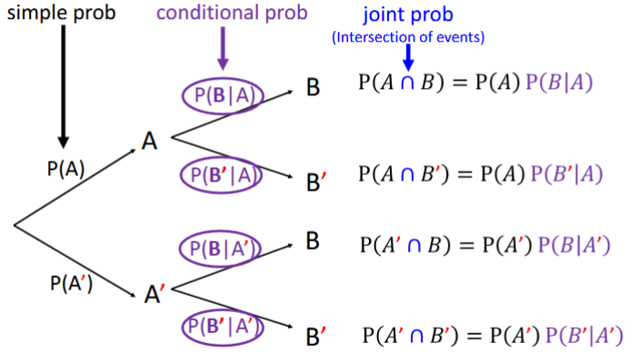

# Course Outcomes
**Aims & Objectives**  
This module serves as an introduction to probability and a foundation for understanding statistics, randomness, and uncertainty.

**Syllabus**  
Basic concepts of probability, conditional probability, independence, random variables, joint and marginal distributions, mean and variance, some common probability distributions, sampling distributions, estimation and hypothesis testing based on a normal population.

## Table of contents  

0. [Introduction to Probability and Statistics](#0-introduction-to-probability-and-statistics)
1. [Sets & Operations](#1-sets--operations)
2. [Counting Methods](#2-counting-methods)
3. [Probability](#3-probability)
4. [Random Variables](#4-random-variables)
5. [Probability Distributions (Single Random Variable)](#5-probability-distributions-single-random-variable)
6. [Joint Distributions (two random variables)](#6-joint-distributions-two-random-variables)
7. [Sampling Distributions](#7-sampling-distributions)
8. [Estimation](#8-estimation)
9. [Hypothesis Testing](#9-hypothesis-testing)

# 0. Introduction to Probability and Statistics
|  | Probability | Statistics |
|---|---|---|
| Parameters (Underlying random processes) | Known  | Unknown |
| Events/Data | Output | Input |

p = population proportion  
$\mu$ = population mean  
P-hat ($\hat{p}$) = sample proportion  
X-bar ($\bar{x}$) = sample mean  
Statistical Experiment: Any procedure generating a set of observations/outcomes  
Sample point/element: Every outcome in a sample space  
Sample space: Set of all possible outcomes of a statistical experiment (represented by symbol `S`)  
Event: Subset of a sample space  

# 1. Sets & Operations
||||
|---|---|---|
| Union (OR) | A ∪ B | Anything that contains at least one of either set |
| Intersection (AND) | A ∩ B | Anything that ONLY contains both intersecting sets |
| Complement (EXCLUDE) | $A^c$ or $A'$ or $\complement A$| Anything that does not inlude the set |
| Null set | $\emptyset$ | Nothing exists in the set |
| Disjoint (Mutually Exclusive) | A ∪ B = $\emptyset$ | No common element among intersecting sets |
| Subset | $A \subset B$ | A part of B  ($A \subset B$) & ($B \subset A$) then A = B|
| Superset | B ⊃ A | B contains A |

De Morgan's Law:
1. $(A_1 \cup A_2 \cup ... \cup A_n )' = A_1' \cap A_2' \cap ... \cap A_n' $
2. $(A_1 \cap A_2 \cap ... \cap A_n )' = A_1' \cup A_2' \cup ... \cup A_n' $

# 2. Counting Methods
* Addition Principle: $n_1 + n_2 + ... + n_k$
* Multiplication Principle: $n_1 \times n_2 \times ... \times n_k$
* Permutation (r-selection without replacement & sequence matters): $ _n P_r = \frac{n!}{(n-r)!}$
    * When r = n, $ _n P_n = \frac{n!}{(n-n)!} = n! $
* Combination (r-selection without replacement & disregard sequence): $ _n C_r = \frac{n!}{r!(n-r)!} = \frac{_n P_r}{r!} $

# 3. Probability
**Axioms of Probability**  
- $0 \leq P(A) \leq 1$ *(between 0 and 1)*
- $P(S) = 1$ *(Probability of sample size = 1)*
- if A_1, A_2 are disjoint ($A_i \cap A_j = \emptyset $ if $i \neq j$), then $P(\bigc$$up_{i=1}^{\infty} A_i) = \sum_{i=1}^{\infty}$
    - if A and B are mutually disjoint, then $P(A \cup B) = P(A) + P(B)$

**Basic Properties of Probability**  
1. $P(\emptyset) = 0$
2. $P(\bigcup_{i=1}^{n})= \sum_{i=1}^{n} P(A_i)$
3. $P(A') = 1 - P(A)$
4. $P(A) = P(A \cap B) + P(A \cup B')$
5. Inclusion-Exclusion Principle:
    - For any two events A and B, $P(A \cup B) = P(A) + P(B) - P(A \cap B)$
    - For any three events A, B, C, $P(A \cup B \cup C) = P(A) + P(B) + P(C) - P(A \cap B) - P(A \cap C) - P(B \cap C) + P(A \cap B \cap C) = P(A \cap B) + P(A \cap C) - P(A \cap B \cap C)$
    - $P(A_1 \cup A_2 \cup ... \cup A_n) = \sum_{i=1}^{n} P(A_i) - \sum_{i=1}^{n-1} \sum_{j=i+1}^{n} P(A_i \cap A_j) + \sum_{i=1}^{n-2} \sum_{j=i+1}^{n-1} \sum_{k=j+1}^{n} P(A_i \cap A_j \cap A_k) - ... + (-1)^{n+1} P(A_i \cap A_j \cap ... \cap A_n)$
6. If $A \subset B$, then $P(A) \leq P(B)$

## Approaches to Probability
**Classical**  
Equally likely  
$P(A) = \frac{Number of sample points in A}{Number of sample points in S}$

**Empirical**  
Relative frequency  
- Let $n_A$ be number of times that event A has occurred among $n$ repetitions
- Then relative freq of event $A$ in $n$ repetitions is $f_A = \frac{n_A}{n}$, where
    - $0 \leq f_A \leq 1$
    - $f_A = 1$ (if A is sure event)
    - $f_A = 0$ (if A is null event)

## Conditional Probability
Conditional probability of $A$ given $B$ has occurred:  
> $P(A|B)$  

Conditional probability of $B$ given $A$ has occurred:  
> $P(A|B) = \frac{P(A \cap B)}{P(A)}, if P(A) \neq 0$  

### Tree Diagram Representation

## Multiplicative Rule of Probability (Intersection of Events)
Used to find probability of **intersection** of events.  
> $P(A \cap B) = P(A)P(B|A)$ or 
> $P(A \cap B) = P(B)P(A|B)$

> [!NOTE]
> This is provided $P(A) > 0, P(B) > 0$

This can be extended to more than 2 events:
> $P(A \cap B \cap C) = P(A)P(B|A)P(C|A \cap B)$ 

> [!NOTE]
> This is provided $P(A \cap B) > 0

Thus, generally speaking: 
> $P(A_1 \cap ... \cap A_n)$
> $= P(A_1)P(A_2|A_1)P(A_3|A_1 \cap A_2)...P(A_n|A_1 \cap ... \cap A_n-1)$

> [!NOTE]
> This is provided $P(A_n|A_1 \cap ... \cap A_n-1) > 0$

## The Law of Total Probability
All parts of A_i (which are mutually exclusive) within a sample space  
* *Suppose sample space = A, split A into parts that do not intersect*
Then for any event B, $P(B) = \sum_{i = 1}^{n} P(B \cap A_i)$ 
* $= \sum_{i = 1}^{n} P(A_i) P(B|A_i)$
In a factory:
* Machine A : 35% of total production. 2% defective.
* Machine B : 25% of total production. 1% defective.
* Machine C : 40% of total production. 3% defective.
(a) What is the probability that a random product is defective?
- $P(D) = P(A)P(D|A) + P(B)P(D|B) + P(C)P(D|C)$
        $= 0.35 * \frac{0.35 * 0.02}{0.35} + 0.25 * \frac{0.25 * 0.01}{0.25} + 0.40 * \frac{0.40 * 0.03}{0.40}$
        $= (0.35 * 0.02) + (0.25 * 0.01) + (0.40 * 0.03)$
(b) What is the probability that product is produced by C, given that it is defective?
- $P(C|D) = \frac{0.40 * 0.03}{0.03}$

## Bayes Theorem
$P(A_k|B) = \frac{P(A_k)P(B|A_k)}{\sum_{i=1}^{n} P(A_i)P(B|A_i)}$  
That is,  
$P(A_k|B) = \frac{P(A_k)P(B|A_k)}{P(B)}$  
Chance of faulty design is 1%. $P(A) = 0.01$  
Chance that house collapse if faulty design is 75%. $P(B|A) = 0.75$  
    (otherwise it is 0.01%) $P(B|A') = 0.0001$  
A house has collapsed. What is the probability it is due to faulty design?  
$P(B) = 0.75 + 0.0001$
$P(A|B) = \frac{P(A)P(B|A)}{P(B)} = \frac{0.01 * 0.75}{0.75 + 0.0001}$  

## Independent Events & The Properties of Independent Events
$P(A \cap B) = P(A)P(B)$  
Meaning A is independent of B = B is independent of A

**Properties of Independent Events**
1. Suppose $P(A) > 0, P(B) > 0$, if $P(A \cap B) = P(A)P(B)$, then:  
    $P(B|A) = P(B)$ and $P(A|B) = P(A)$
2. If $A$ and $B$ are independent, then:  
    $A B'$
    $A' B$
    $A' B'$
3. Suppose $P(A) > 0, P(B) > 0$, if $P(A \cap B) = P(A)P(B)$, then:  
    $A$ and $B$ **CANNOT BE mutually exclusive**.  
    __Proof__  
    Since A and B are independent events ($P(A) > 0, P(B) > 0$), thus:  
    $P(A \cap B) = P(A)P(B) > 0$  
    Since $P(A \cap B) \neq 0$, thus $A \cap B \neq \emptyset$
4. Suppose $P(A) > 0, P(B) > 0$, if A and B are mutually exclusive, then:  
    $A$ and $B$ **CANNOT BE independent**.  
    __Proof__  
    Since A and B are mutually exclusive events ($P(A \cap B) = 0$):  
    On the other hand, $P(A) > 0$ and $P(B) > 0$ implies that :  
        $P(A)P(B)>0$  
    Therefore $P(A \cap B) \neq P(A)P(B)$, thus A and B NOT independent.
5. $S$ and $\emptyset$ are independent of any event
6. If $A \subset B$, then $A$ and $B$ are DEPENDENT *unless B = S*

## Remarks about Independent Events:
**Mutually Exclusive, NOT Independent**
$A$ = {1,3,5} & P(A) = 0.5  
$D$ = {2,4,6} & P(D) = 0.5  
$P(A \cap D) = 0$, thus are mutually exclusive.  
Since $P(A)P(D) \neq P(A \cap D)$, thus not independent.

**NOT Mutually Exclusive, NOT Independent**
$A$ = {1,3,5} & P(A) = 0.5  
$D$ = {1,2,3} & P(D) = 0.5  
$P(A \cap D) = {1,3}$, thus are not mutually exclusive.  
$P(A \cap D) = \frac{1}{3}$
$P(A)P(D) = \frac{1}{4}$  
Since $P(A)P(D) \neq P(A \cap D)$, thus not independent.

**NOT Mutually Exclusive, Independent**
$A$ = {1,3,5} & P(A) = $\frac{1}{2}$  
$D$ = {1,2,3,4} & P(D) = $\frac{2}{3}$  
$P(A \cap D) = {1,3}$, thus are NOT mutually exclusive.  
Since $P(A)P(D) = \frac{1}{3} = P(A \cap D)$, thus not independent.

# 4. Random Variables
## 4.1.1 Discrete Uniform Distribution
**Definition**: If random variable $X$ assumes values $x_1, x_2, ..., x_k$ *(with equal probability)*, then $X$ is said to have **discrete uniform distribution**  
**Probability function**: $fx(x) = \frac{1}{k}$ where $x = x_1, x_2, ..., x_k$, 0 otherwise  
**Mean** $\mu = E(X) = \sum_{all x} x fx(x)$  
**Variance** $\sigma^2 = V(X) = E(X^2) - \mu^2$

## 4.2.1 Bernoulli Distributions
**Definition**: Random experiment, 2 possible outcomes (*success*) or (*failure*). Convenient to code the two outcomes as `1` or `0`.  
Random variable $X$  is defined to have Bernoulli Distributions if probability function of $X$ is given by $fx(x) = p^x (1-p)^{1-x}, where x = 0 or 1$ where $0 < p < 1$.  
$f(x) = 0$ for other $X$ values.  
**Mean** $\mu = E(X) = p$  
**Variance** $\sigma^2 = V(X) = p(1 - p) = pq$

## 4.2.2 Binomial Distributions
**Definition**: Sequence of $n$ independent Bernoulli trials.  
$X$ refers to __number of successes__.  
Random variable $X$ is defined to have Binomial Distribution with 2 parameters $n$ and $p$ *($X$ ~Binomial($n,p$))*, if probability function of $X$ is given by $P(X = x) = fx(x)$  
        $=\binom{n}{x}p^x(1-p)^{n-x}$  
        $=\binom{n}{x}p^xq^{n-x}$  
where $p$ satisfies $0 < p < 1$, $q = 1 - p$, and $n$ ranges over positive integers.  
**Mean** $\mu = E(X) = np$  
**Variance** $\sigma^2 = V(X) = np(1 - p) = npq$  

Conditions for Binomial Experiment: 

1. Only 2 possible outcomes

2. Consists of $n$ indepenent Bernoulli trials. *(P(success) = p is the same constant in each trial)*

## 4.2.3 Poisson (& Poisson appx to Binomial)
**Definition**: 
**Mean** $\mu = E(X) = $  
**Variance** $\sigma^2 = V(X) = $

## 4.2.4 Hypergeometric
**Definition**: 
**Mean** $\mu = E(X) = $  
**Variance** $\sigma^2 = V(X) = $

## 4.3.1 Negative Binomial
**Definition**: 
**Mean** $\mu = E(X) = $  
**Variance** $\sigma^2 = V(X) = $

## 4.3.2 Geometric
**Definition**: 
**Mean** $\mu = E(X) = $  
**Variance** $\sigma^2 = V(X) = $

# 5. Probability Distributions (Single Random Variable)

# 6. Joint Distributions (two random variables)

# 7. Sampling Distributions

# 8. Estimation

# 9. Hypothesis Testing